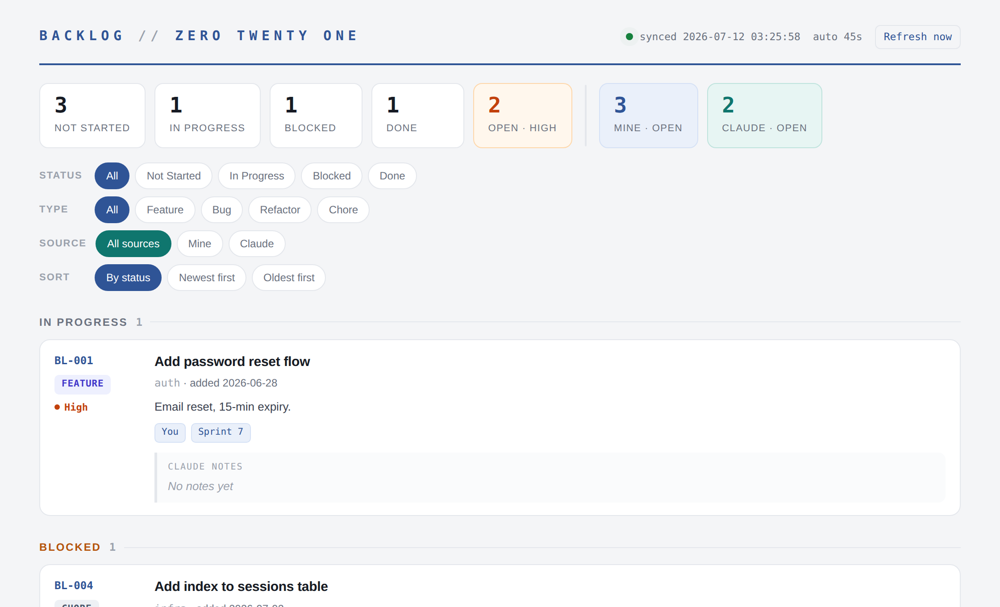

# Claude Code Backlog

> A lightweight, phone-friendly backlog that [Claude Code](https://docs.claude.com/en/docs/claude-code) drains at the end of each coding session. Jot ideas anywhere; Claude Code turns them into fully-authored tasks — tracked in a spreadsheet you never open, viewed through a clean read-only dashboard.

[](LICENSE)

When you build with Claude Code, new ideas and feature-creep hit mid-session. Interrupting derails the work; not capturing them loses the idea. **Claude Code Backlog** gives those ideas a home: you drop one-liners into an inbox (from your phone, even), and at natural stopping points Claude Code authors them into structured tasks, asks what to tackle now versus later, does the work, and records what it did.



## Features

- **Capture from anywhere** — an iCloud text-file inbox you can add to from your phone.
- **Auto-authored tasks** — from a one-line idea, Claude Code fills in every field: type, priority, component, acceptance criteria, and a ready-to-run kick-off prompt.
- **You never touch the spreadsheet** — add via the inbox, view via the dashboard.
- **Read-only dashboard** — self-refreshing, offline, no build step. Sort by date, filter by status / type / source, with separate open-item counts.
- **Source tracking** — see at a glance which items you requested versus which Claude Code added on its own.
- **Sprint-end workflow** — Claude Code triages the backlog with you at the end of each session; nothing starts without your go-ahead.
- **Dependencies, status & notes** — Blocked items, prerequisites, completion dates, and Claude's notes on what changed and why.
- **Safe by design** — the backlog lives outside version control, and a built-in smoke test verifies the whole loop without touching your code.

## How it works

1. **Capture** — you add a one-line idea to the iCloud inbox.
2. **Drain** — at the end of a session you tell Claude Code the sprint is done; it reads the inbox and authors each idea into a backlog row.
3. **Decide** — it lists new and pending items and asks: do it now, or a later sprint?
4. **Do** — it works the "now" items in priority order, following each task's kick-off prompt.
5. **Record** — it marks them Done, stamps the date, writes notes, and refreshes the dashboard.

## Requirements

- macOS with [Claude Code](https://docs.claude.com/en/docs/claude-code)
- Python 3 — check with `python3 --version`
- iCloud Drive (for phone capture)
- Full Disk Access enabled for your terminal app, so it can read the iCloud inbox

## Quick start

1. Copy the **`BACKLOG/`** folder from this repo into your project's root.
2. Ensure the one dependency: `pip3 install openpyxl --break-system-packages`
3. Turn on **Full Disk Access** for your terminal app (System Settings → Privacy & Security → Full Disk Access), then restart it.
4. Create the inbox file:
   ```
   touch "$HOME/Library/Mobile Documents/com~apple~CloudDocs/backlog-inbox.txt"
   ```
5. Paste **`prompts/claude-md-block.md`** into a `CLAUDE.md` file at your project's root.
6. Generate and open the dashboard:
   ```
   python3 BACKLOG/generate_dashboard.py
   open BACKLOG/dashboard.html
   ```
7. Smoke test: tell Claude Code *"We just finished a sprint — run the end-of-sprint backlog check,"* and run the built-in `BL-000` item. It only creates a throwaway file — no code is touched. When it lands in "Done" on the dashboard, you're live.

📄 Full walkthrough: **[docs/Deployment-Tutorial.docx](docs/Deployment-Tutorial.docx)**. Day-to-day reference: **[docs/Usage-Cheat-Sheet.docx](docs/Usage-Cheat-Sheet.docx)**.

## Usage

- **Add an idea:** drop a line in the iCloud inbox (phone or Mac), or tell Claude Code *"add to the backlog: …"*.
- **Process the backlog:** *"We just finished a sprint — run the end-of-sprint backlog check."*
- **View:** keep `BACKLOG/dashboard.html` open — it refreshes itself every 45 seconds.

You can optionally set up a brainstorming Claude Project using `prompts/brainstorm-project.md`: think an idea through, and it hands you the exact one-line entry to drop in the inbox.

## Repository structure

```
BACKLOG/
  BACKLOG.xlsx            the spreadsheet template (includes a BL-000 smoke test)
  generate_dashboard.py   builds the read-only dashboard from the spreadsheet
prompts/
  claude-md-block.md      the rules to paste into your project's CLAUDE.md
  brainstorm-project.md   optional instructions for a brainstorming Claude Project
docs/                     printable Word guides (tutorial, cheat sheets, moving guide)
assets/                   dashboard screenshot
```

## Troubleshooting

| Symptom | Fix |
|---|---|
| `command not found: python` | Use `python3`. |
| `Operation not permitted` | Your project is in Documents/iCloud — move it to a plain folder like `~/dev`. See `docs/Moving-Your-Project.docx`. |
| `openpyxl is required` | `pip3 install openpyxl --break-system-packages` |
| Claude Code says the inbox is empty (but it isn't) | Grant Full Disk Access to your terminal app, then restart it. |
| Dashboard shows old data | It reloads every 45s; click "Refresh now," and confirm Claude Code ran the generator. |

## Credits

Created by [Christian Taylor](https://www.linkedin.com/in/mrchristiantaylor/).

## License

[MIT](LICENSE) — free to use, modify, and share.
